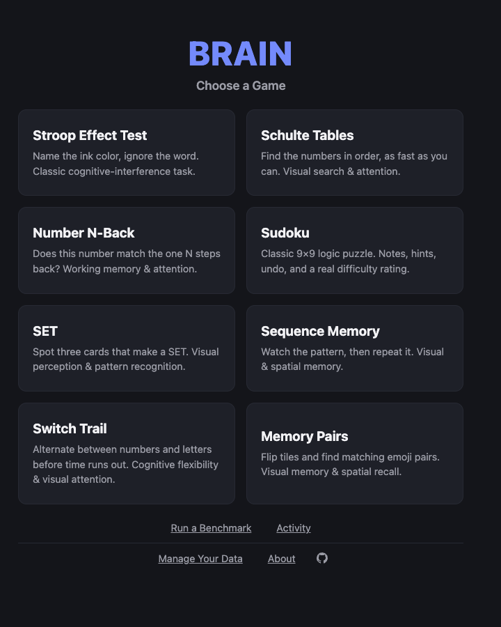
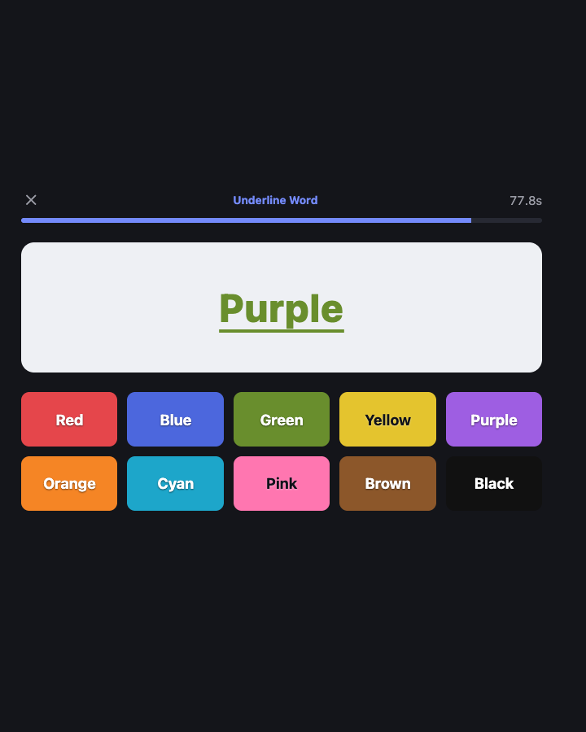
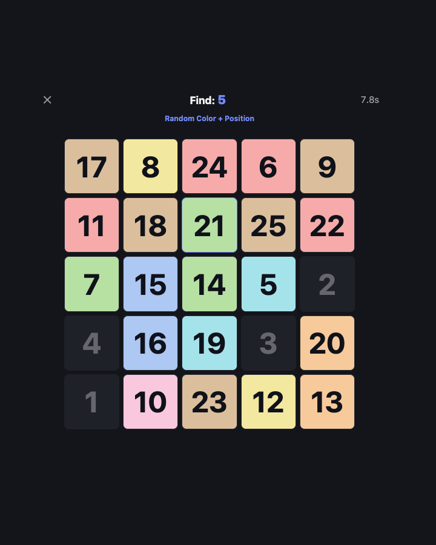
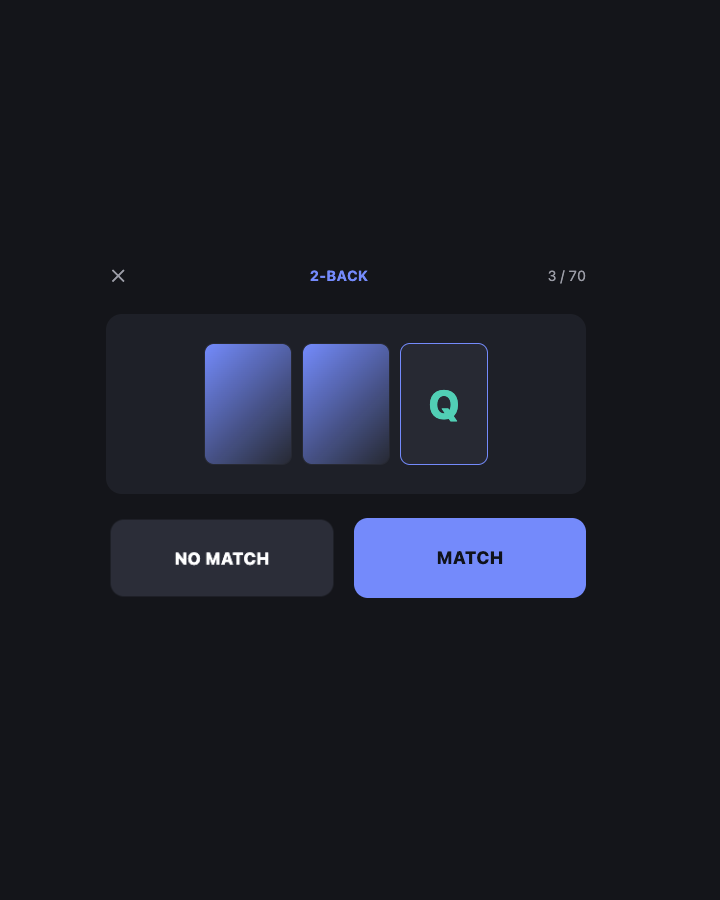
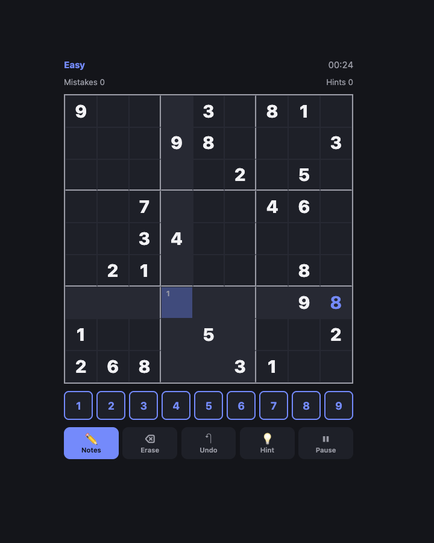
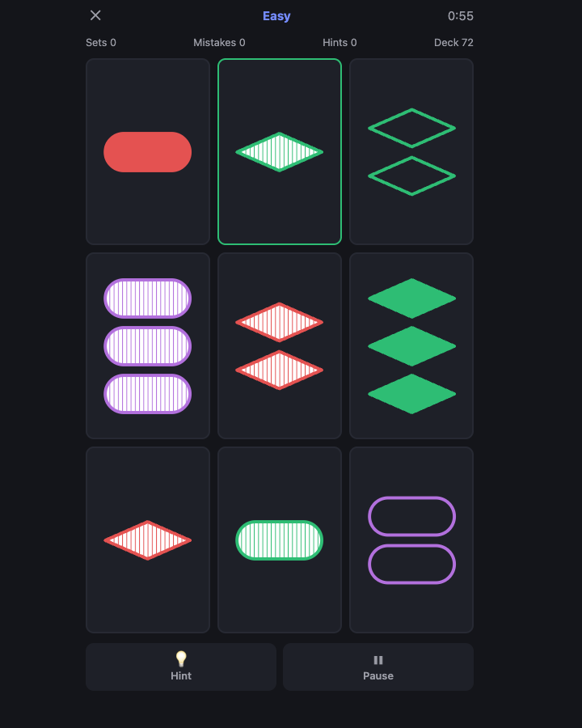
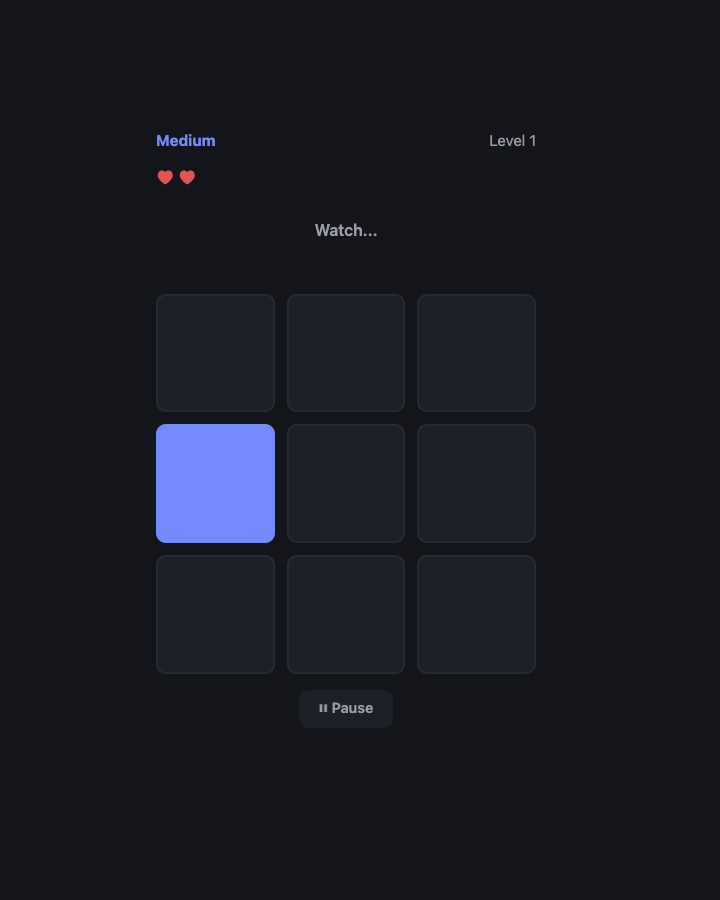
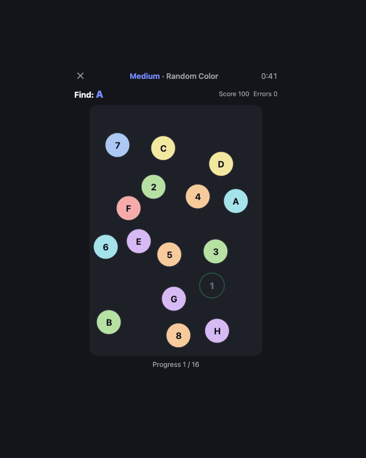
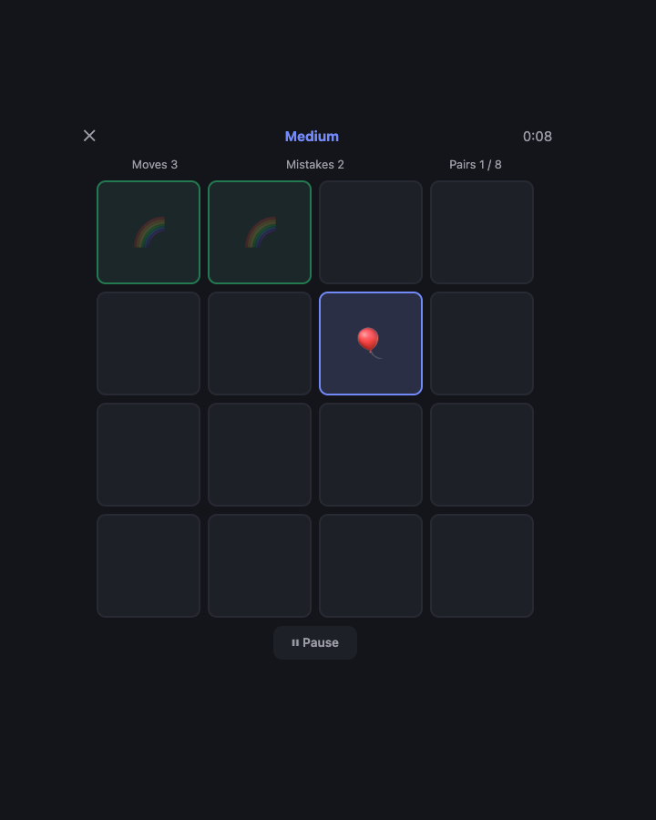

# Brain



Brain is a small collection of offline cognitive games for attention, memory, visual search,
reasoning and pattern recognition. The idea: instead of opening social media when you have a few
minutes free, open Brain and play a small game instead.

It's a Vue 3 + Vite app. Also deployed at brain.ebal.gr. Pick a game from the landing screen; each
keeps its own scoring, history and personal bests. There's also a suite-wide
[Benchmark mode](#benchmark-mode) with [personal baselines](#personal-baseline), an
[Activity dashboard](#activity-dashboard), and full [data export/import](#your-data).

**Brain measures your performance on these specific games, over time.** It isn't a measure of
general intelligence, brain health or clinical cognitive ability, and doesn't claim to be.
Repeated practice can raise a score just from getting familiar with a task's mechanics, so a rising
score means better performance on that particular game, not proven improvement in general
cognition. Benchmark and Activity always compare you against your own past results, never a
population average or another player.

| Game | Main focus |
| --- | --- |
| [Stroop Effect Test](#stroop-effect-test) | Inhibition / interference |
| [Schulte Tables](#schulte-tables) | Visual search / attention |
| [Number N-Back](#number-n-back) | Working memory |
| [Sudoku](#sudoku) | Logic / reasoning |
| [SET](#set) | Pattern recognition |
| [Sequence Memory](#sequence-memory) | Visuospatial sequence memory |
| [Switch Trail](#switch-trail) | Cognitive flexibility |
| [Memory Pairs](#memory-pairs) | Visual/spatial associative memory |

Detailed rules, scoring formulas and design rationale for each game live in its own `*-SPEC.md`
file, linked from each section below.

## Stroop Effect Test



The classic [Stroop effect](https://en.wikipedia.org/wiki/Stroop_effect) task: name the **ink
color** a word is printed in, not what the word says. Most trials are deliberately incongruent,
which is what produces the measurable slowdown the test is named for.

- Three modes: Color Match (the classic task), Word Match (the reading-control condition), and
  Underline Word (a task-switching variant of Color Match where a random fraction of trials flip
  the target to the word).
- Four difficulty tiers, scaling color count and incongruent ratio together.
- Tracks accuracy, response time and an interference score (incongruent RT minus congruent RT).
  Personal bests and history are kept per mode and difficulty.

See [`SPEC.md`](./SPEC.md) for the full design rationale and changelog.

## Schulte Tables



A [Schulte Table](https://en.wikipedia.org/wiki/Schulte_table) visual-search drill: find numbers 1
to N² in order on a grid that's generated once and never moves. It measures scanning and
attention, not memory.

- Six grid sizes, 3×3 through 8×8, with 5×5 as the Classic reference difficulty. No round timer;
  a round just ends when the last number is found.
- Personal bests require a zero-error round, so a fast run full of mistakes can't set a record.
- Two optional variants, toggled independently at any grid size: **Random Color** (a random
  background color per cell) and **Random Position** (numbers reshuffle among unsolved cells after
  every correct tap). Each is tracked separately from Classic.

See [`Schulte-SPEC.md`](./Schulte-SPEC.md) for the full design rationale.

## Number N-Back



Numbers appear one at a time as flipping playing cards: does the current card match the one shown
**N positions earlier**? The trailing N cards stay laid out face-down next to the current one, so
you can see how far back N is, but their value is hidden again as soon as a newer card arrives.
Recalling what's under them is still the actual task.

- Three N levels, 2-back through 4-back, with 2-back as the Classic reference difficulty.
  Difficulty comes from how far back you remember, not a bigger number pool.
- **Extreme** keeps the 2-back distance but swaps numbers for a fixed consonant pool (C, H, K, L,
  Q, R, S, T) over a longer, 70-trial round. Vowels are excluded because they're easier to
  remember than consonants.
- Self-paced: the stimulus waits for your response, no reaction-time pressure.
- Sequences are generated and validated to keep the target ratio stable across rounds.
- Score and accuracy are tracked separately from raw hit/miss/false-alarm counts.

See [`NBack-SPEC.md`](./NBack-SPEC.md) for the full design rationale.

## Sudoku



Classic 9×9 Sudoku, rated by an actual logical solver rather than clue count. Easy/Medium/Hard
reflects the hardest technique genuinely needed to solve it, not a guess. Every puzzle is verified
to have exactly one solution.

- Easy and Medium generate live in a background worker; Hard is served from a small pool of
  pre-vetted puzzles, since live generation was impractically slow for that difficulty.
- Notes with auto-clearing and full undo. Mistakes are flagged immediately; there's no
  three-strikes fail state, so you can always finish the puzzle.
- Unlimited hints, but using any disqualifies that solve from the zero-hint **Clean Best** time.
- Autosave and Continue Game. The timer pauses and the board hides when the tab goes to the
  background.

See [`Sudoku-SPEC.md`](./Sudoku-SPEC.md) for the full design rationale.

## SET



The classic pattern-recognition card game, rendered entirely with inline SVG so it stays
offline-capable. Find three cards where every property (number, shape, color, shading) is all the
same or all different, checked against the actual rule rather than a lookup table.

- Four difficulties: Easy (9 cards, explains wrong guesses, starts every board with one free hint
  card revealed), Medium and Hard (12 cards, Hard drops the explanation), and Extreme (15 cards,
  same assistance as Hard). Board size changes; the math never does.
- Progressive hints, unlimited but any use disqualifies a new **Clean Best** (Easy's one free card
  is exempt, so a Clean Best is still reachable there).
- Optional Light Colors toggle for a softer card palette, purely cosmetic.
- A direct exit button with confirmation, available mid-game and not just from Pause.
- Autosave and Continue Game, auto-pause when the tab is hidden, per-difficulty stats and history.
- No synthetic score. Completion time, mistakes, hints and find time are the primary measurements.

See [`SET-SPEC.md`](./SET-SPEC.md) for the full design rationale.

## Sequence Memory



A "Simon Says"-style memory game: watch a sequence of flashes on a 3×3 grid, then tap the same
cells back in order. Each success extends the same sequence by one step, so it measures how long
a pattern you can hold, not luck.

- Difficulty changes lives and playback speed only, never grid size, so results stay comparable
  across a session.
- A mistake replays the same sequence again, never a new one, as long as a life remains.
- Cells have no permanent identity, only a temporary flash, so what's remembered is position and
  order alone.
- Longest sequence completed is the primary result and personal-best metric.

See [`Sequence-Memory-SPEC.md`](./Sequence-Memory-SPEC.md) for the full design rationale.

## Switch Trail



A Trail Making-inspired task-switching game: tap scattered targets in alternating order (1, A, 2,
B, 3, C...) before time runs out. Targets are placed once per round and never move, so it measures
visual search and switching, not memory of positions.

- Four difficulties. The last, Extreme, reshuffles every remaining target's position after each
  correct tap. Difficulty comes from density and switching, never tiny targets.
- Board generation guarantees no overlapping or impractical targets.
- A wrong tap costs points and flashes red but never ends the round.
- Optional Random Color variant, available at every difficulty and tracked separately.

See [`Switch-Trail-SPEC.md`](./Switch-Trail-SPEC.md) for the full design rationale.

## Memory Pairs



A classic emoji Concentration game: flip two face-down tiles at a time and find every matching
pair. The board is generated once and never changes, so it measures visual memory and spatial
recall.

- Five difficulties, scaling only through how many tile locations you have to remember, never
  tile size or timing.
- Score rewards completion, fewer Moves and fewer Mistakes. A mismatch counts as both, so it
  costs more than a random guess is worth.
- **Move Efficiency** (the theoretical minimum Moves divided by actual Moves) is tracked
  separately from Score.
- Autosave and Continue Game. Pausing cancels any in-progress selection without penalty.

See [`Memory-Pairs-SPEC.md`](./Memory-Pairs-SPEC.md) for the full design rationale.

## Benchmark Mode

Fixed-difficulty runs of seven of the eight games, reachable via **Run a Benchmark** below the game
grid, so a result today is comparable to one from months ago rather than a personal best set on
whatever difficulty you happened to pick. Starting a benchmark locks the configuration: Stroop
(Medium, Color Match), Schulte (5×5 Classic), N-Back (2-Back), SET (Medium), Sequence Memory
(Medium), Switch Trail (Medium, 16 targets), Memory Pairs (Medium, 8 pairs).

- **Sudoku is excluded.** Puzzle difficulty genuinely varies within one labeled tier, so a fixed
  Sudoku benchmark would mostly measure which puzzle you got, not your performance.
- A benchmark run also counts as a normal play session, recorded in that game's usual history and
  stats as well as a separate benchmark history.
- Every benchmark session is stamped with a version number, so if these fixed configurations ever
  change, old and new results are never mixed into the same comparison.

Regular (non-benchmark) history entries carry the same idea: a per-game `metricVersion` (currently
`1` everywhere) and the app version that recorded them. If a score formula or measurement ever
changes meaningfully, that game's version number gets bumped so old and new sessions are never
silently averaged together. Entries from before this field existed are treated as version 1.

## Personal Baseline

Once a game has at least 3 recorded benchmark sessions, a baseline exists: the median of that
game's primary benchmark metric (completion time, score, or longest sequence, depending on the
game). Every benchmark run after that compares against your own history *before* that run, eg.
`Baseline (n=5): 2.5s, Today: 2.1s (+16.0% better)`. There's no population average and no other
players to compare against (no such dataset exists or is fabricated). Before 3 sessions exist, it
just tells you how many more you need.

## Activity Dashboard

A suite-wide view, reachable via **Activity**, of how much you've played and how your benchmark
performance is trending, filterable to the last 7, 30, 90 days or all time.

- **Overview**: current activity streak, games played, active days, total sessions. A streak still
  counts through yesterday if you haven't played yet today.
- **Sessions by Game**: a per-game session count for the selected range.
- **Benchmark Performance**: per game (Sudoku excluded, same reasoning as Benchmark Mode above),
  your baseline, rolling median, a consistency measure (median absolute deviation), best result,
  most recent result, and today vs. baseline. Every stat shows its sample size, so a trend from 3
  sessions is never confused with one from 40.

There's no unified cross-game score and no invented population percentiles. A note on the page
itself says these numbers describe performance on specific tasks over time, not general cognitive
ability, and that practice alone can raise a score.

## Your Data

Reachable via **Manage Your Data**. There's no account and no backend, so this is the only way to
back up or move your data.

- **Export All Data (JSON)**: a complete backup of history, stats, personal bests, benchmark
  history and any in-progress game, across every game. Versioned so a future format change is
  never misread as an older one.
- **Export History (CSV)**: a flattened, spreadsheet-friendly view of every session across every
  game.
- **Import**: restore from a previously exported JSON file. Shows a preview (record counts per
  game) before writing anything, with a choice between **Merge** (combine both, keep this device's
  stats on conflict) and **Replace** (wipe first). Rejects anything that isn't a recognizable
  export, with a specific reason.
- **Delete All Data**: permanently erases everything stored on this device. Gated behind typing
  `DELETE`, since it can't be undone.

## Offline / installable (PWA)

The whole suite installs as a Home Screen app on iOS, Android and desktop, and works fully offline
once installed. There's no network dependency for gameplay to begin with (no fonts, CDNs,
analytics or API calls anywhere in the app), so the entire app shell gets precached by a Service
Worker and served from cache afterward. All data (scores, history, stats, an in-progress game)
lives in `localStorage` and works the same offline, since it was never network-backed.

This only applies to a **production build** (`npm run build`, served via `npm run preview` or
similar). `npm run dev` intentionally serves no Service Worker, so local development is unaffected.
Installing on a phone also requires HTTPS, a browser rule and not something this app controls. See
§10 of [`SPEC.md`](./SPEC.md) for details.

## Privacy

No account, no backend, no ads, no analytics or tracking of any kind. Every game's history, stats
and settings live only in this browser's `localStorage`; nothing is ever sent anywhere, online or
offline. Clearing your browser data or switching devices loses everything unless you've exported
it first (see [Your Data](#your-data) above).

## Development

### Requirements

- [Node.js](https://nodejs.org/) 20+ and npm, for local development.
- [Docker](https://www.docker.com/) and Docker Compose, optional if you'd rather not install
  Node locally.

### From source

```bash
git clone https://github.com/ebal/brain.git
cd brain
npm install
```

### Local development

```bash
npm run dev
```

Starts the Vite dev server (with hot reload). Open the printed local URL in your browser.

### Production build

```bash
npm run build   # outputs static files to ./dist
npm run preview # serve the build locally to sanity-check it
```

### Docker (dev server, no build step)

Runs the Vite dev server itself inside the container, directly against the bind-mounted source,
with full hot-reload. No Node install on the host, no build, no rebuild step.

```bash
docker compose up
```

Open `http://localhost:5173`, edit any file, the browser updates instantly. Stop with
`docker compose stop`.

This runs Vite's own dev server (unminified, dev-only tooling), not an optimized production build.
Fine for local/personal use. `npm run build && npm run preview` (above) is the closest built-in
equivalent to a production deployment.

> **Don't expose this dev server on a public host.** It never serves a Service Worker (`main.js`
> skips registration under `vite dev`), so none of the PWA/offline support applies, and a
> `git pull` + `docker compose down && up` cycle is the only way to pick up new code. Worse, if
> that same origin ever *did* serve a production build at some point, browsers that registered its
> Service Worker then will keep serving that old cached build forever. The dev server never sends
> a new one to replace it. For a real deployment, build a static artifact and serve it (eg. an
> on-demand `builder` service running `npm run build`, feeding an always-on `nginx:alpine` serving
> `./dist`) instead of running the dev server as "production."

#### File ownership

The container bind-mounts the whole project and writes into it (`node_modules`, `.npm-cache`), so
it runs as `${DOCKER_UID:-1000}:${DOCKER_GID:-1000}` instead of root, otherwise those files would
end up root-owned on your host. The default (`1000:1000`) matches the first regular user on most
single-user Linux installs; if your account uses a different UID/GID, set it once in a local `.env`
file (already gitignored, so it stays machine-specific):

```bash
printf "DOCKER_UID=%s\nDOCKER_GID=%s\n" "$(id -u)" "$(id -g)" > .env
```

Compose picks up `.env` automatically from then on, no need to pass anything on the command line.

## Project structure

All eight games live in one Vue app, chosen from a landing screen (`GameChooser.vue`) in
`App.vue`. Stroop's files sit flat under `components/`, `composables/` and `constants/`; the other
seven each have their own subfolder (`schulte/`, `nback/`, `sudoku/`, `set/`, `sequence-memory/`,
`switchtrail/`, `memorypairs/`), all with the same shape: a `MainMenu`/`AboutPage`/`HistoryPage`/
`GameScreen`/`ResultsScreen` set of components, a `useXGame.js` state machine plus storage/stats
composables, and a `difficulties.js` constants file. Benchmark Mode, the Activity dashboard and
Data Management are cross-cutting rather than per-game, so they live top-level alongside
`GameChooser.vue`.

```
brain/
├── SPEC.md, <Game>-SPEC.md ...   # one design doc per game
├── docker-compose.yml, package.json, vite.config.js, vitest.config.js
├── public/                       # PWA icons
└── src/
    ├── App.vue
    ├── components/                # GameChooser, BenchmarkMenu, ActivityDashboard, DataManagement,
    │                               # AboutBrain, Stroop's own screens flat here, and one folder
    │                               # per remaining game (same MainMenu/AboutPage/... shape)
    ├── composables/                # mathStats, sessionModel, benchmarkHistory, baseline,
    │                               # activityStats, dataPortability, plus one folder per game
    └── constants/                  # benchmark, metricVersions, plus one folder per game
```

Each game's own `*-SPEC.md` (linked from its section above) has the full design rationale: rules,
difficulty tuning, scoring formulas, and storage shape.

## Testing

```bash
npm test
```

Runs the automated test suite ([Vitest](https://vitest.dev/)): deterministic unit tests for the
actual game math and generation logic across all eight games (trial/board/sequence generation,
validators, difficulty classification, scoring, statistics), plus the shared session model,
Benchmark, and Baseline logic. No component/DOM testing yet, everything covered so far is plain JS
logic, testable without mounting a Vue component. Each tested module has a co-located `*.test.js`
file next to it.

## License

[MIT](./LICENSE)
